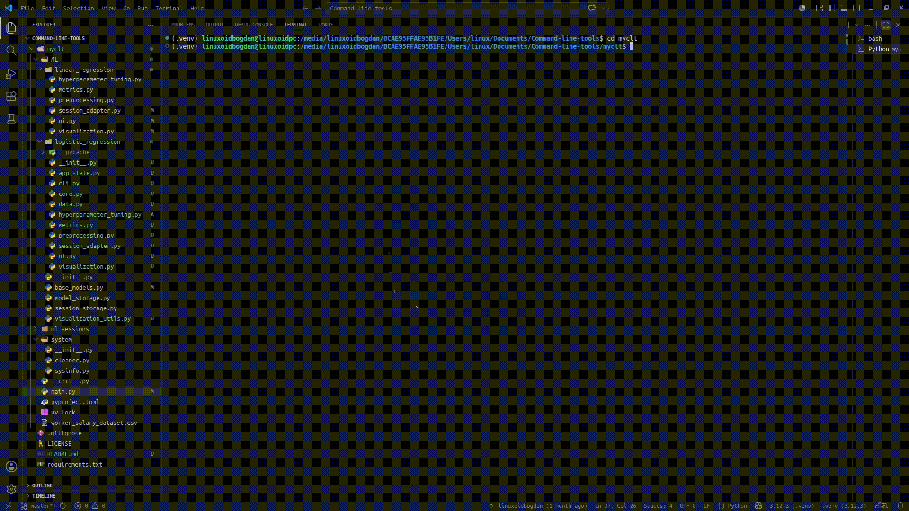
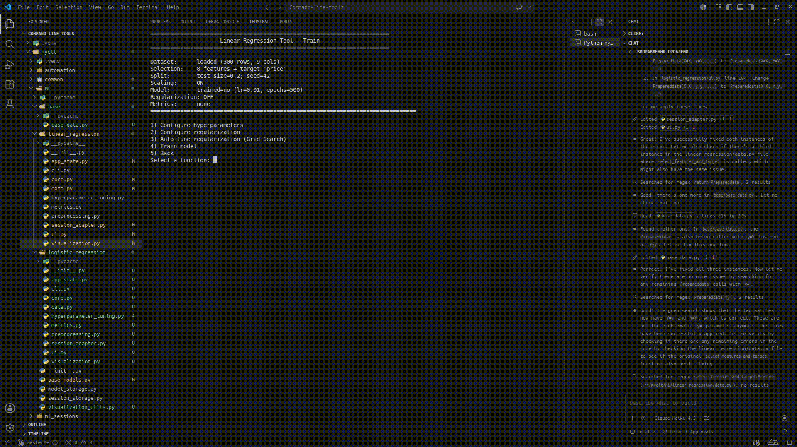
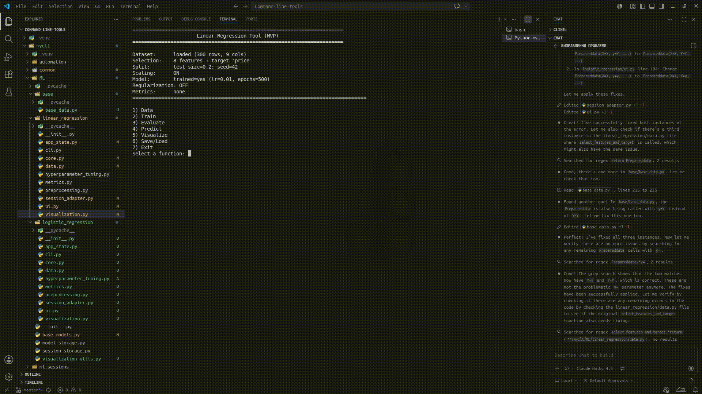

# 🔧 Command-line-tools

A comprehensive collection of command-line utilities for system management, project automation, and machine learning. This project is designed for educational purposes to enhance skills in machine learning and software development.

## 📋 Overview

This project implements machine learning algorithms from scratch without relying on high-level libraries like [Scikit-learn](https://scikit-learn.org/stable/). It demonstrates core ML concepts and algorithms using modular, well-tested Python code.

### Features

- **Machine Learning Algorithms**: Linear Regression and Logistic Regression with gradient descent optimization
- **Hyperparameter Tuning**: Grid search capabilities for regularization parameters
- **Data Preprocessing**: Feature scaling, train/test splitting, and data validation
- **Session Management**: Save/load trained models with full reproducibility
- **Visualization**: Loss curves, predictions, and model analysis plots
- **System Utilities**: Project management and system information
- **Pure Python Implementation**: Built with NumPy for numerical computations

## 💻 How It Works

The project uses **NumPy** as the core numerical library for mathematical computations. All machine learning algorithms are implemented from scratch, providing educational insights into how these algorithms work internally.

**Knowledge Sources**: Concepts and implementations are based on [GeeksforGeeks — Python AI](https://www.geeksforgeeks.org/artificial-intelligence/python-ai/) and standard ML textbooks.

---

## 📦 Project Structure

```
myclt/
├── ML/                          # Machine Learning module
│   ├── base_models.py          # Abstract base classes for all models
│   ├── session_storage.py      # Model persistence and loading
│   ├── linear_regression/      # Linear Regression implementation
│   │   ├── core.py             # Core gradient descent algorithm
│   │   ├── data.py             # Data handling and preprocessing
│   │   ├── metrics.py          # Evaluation metrics (MSE, RMSE, R²)
│   │   ├── ui.py               # Interactive CLI menu
│   │   └── visualization.py    # Plotting and visualization
│   └── logistic_regression/    # Logistic Regression implementation
├── automation/                  # Project automation utilities
├── system/                       # System utilities
└── common/                       # Shared utilities and helpers
```

---

## ⚙️ Requirements

- **Python**: ≥ 3.12
- **NumPy**: ≥ 1.24.0
- **Matplotlib**: ≥ 3.7.0 (for visualization)
- **psutil**: ≥ 5.9.0
- **send2trash**: ≥ 1.8.0
- **pipreqs**: ≥ 0.5.0

## 🚀 Installation

```bash
# Clone the repository
git clone https://github.com/bogdanphtemov/Command_line_tools.git
cd Command_line_tools

# [Recommended] Create and activate virtual environment
python3 -m venv .venv
source .venv/bin/activate   # Linux/macOS
# .venv\Scripts\activate    # Windows

# Install the project (will install all dependencies)
pip install -e .
```

## 🎮 Usage

```bash
# From the project root (Command_line_tools)
python -m myclt
# or if you activated the virtual environment:
# just: myclt
```

> **Note:** `python -m myclt` працює з будь-якої папки після встановлення пакета.

### Якщо ви не хочете встановлювати пакет:
```bash
# Достатньо запускати з кореня проекту:
python -m myclt
# або
python3 -m myclt
```

> **Не потрібно** заходити всередину папки `myclt/`! Проект запускається з кореня.

This launches an interactive menu where you can:
1. Load and explore datasets
2. Select features and target variables
3. Configure train/test splits
4. Train machine learning models
5. Tune hyperparameters
6. Evaluate model performance
7. Save and load trained models

---

## 🎥 Demo

Interactive Linear Regression Training:



Model Configuration and Visualization:



Prediction and Evaluation:



---

## 🛠️ Technologies & Libraries

| Category | Tools |
|----------|-------|
| **Language** | Python 3.12+ |
| **Numerical Computing** | NumPy |
| **Visualization** | Matplotlib |
| **System Utilities** | psutil, send2trash |
| **Package Management** | pipreqs |

---

## 📝 License

This project is licensed under the [MIT License](LICENSE) - feel free to use and modify for educational purposes.

---

## 🤝 Contributing

This is an educational project. Contributions, suggestions, and feedback are welcome!


